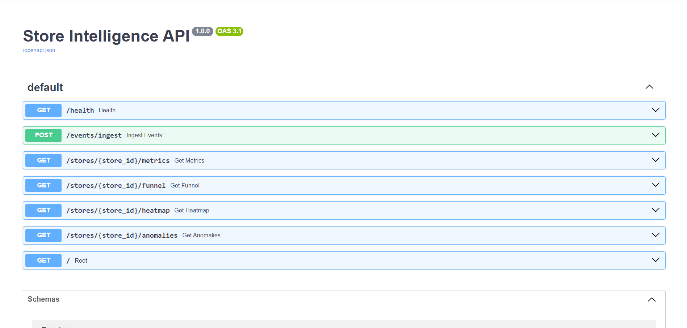
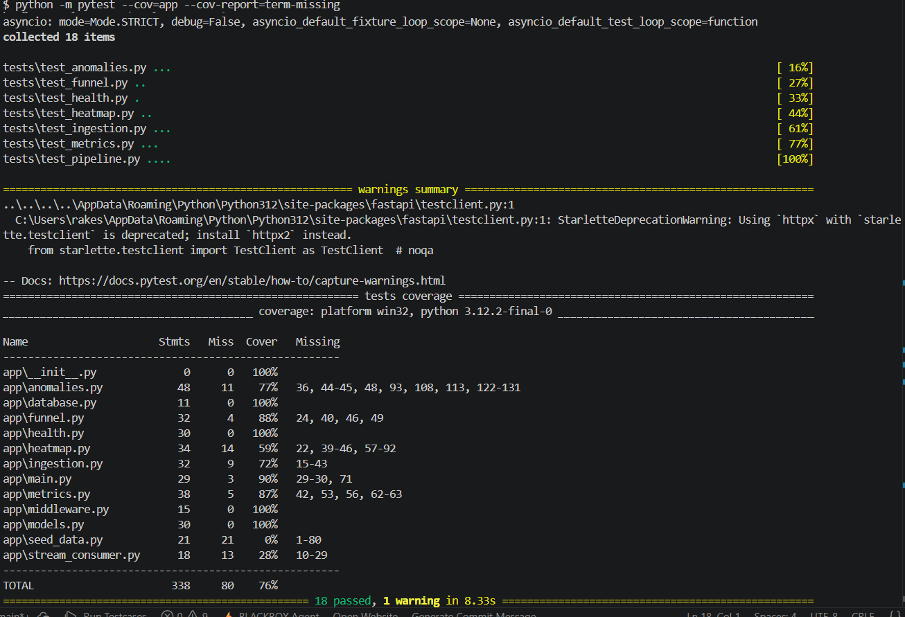

# Store Intelligence Platform

A retail analytics platform that ingests customer movement events, computes business metrics, detects anomalies, and visualizes store performance through a dashboard.

---

## Overview

Store Intelligence simulates a modern retail analytics system that tracks customer movement throughout a store and transforms raw events into actionable business insights.

The platform provides:

* Event ingestion API
* Visitor analytics
* Conversion funnel analysis
* Zone heatmap generation
* Operational anomaly detection
* Real-time dashboard visualization
* Dockerized deployment

---

## Features

### Event Ingestion

Accepts customer movement events through REST APIs.

Supported event types:

* ENTRY
* EXIT
* REENTRY
* ZONE_ENTER
* ZONE_EXIT
* ZONE_DWELL
* BILLING_QUEUE_JOIN
* BILLING_QUEUE_ABANDON
* PURCHASE

### Analytics

* Visitor metrics
* Conversion funnel tracking
* Zone traffic heatmaps
* Conversion analysis

### Anomaly Detection

Detects:

* Low conversion rates
* No-purchase scenarios
* Billing queue spikes
* Dead zones

### Dashboard

Provides:

* Real-time metrics
* Funnel visualization
* Heatmap visualization
* Operational alerts

---

## Architecture

```text
Detection Pipeline
        ↓
Event Ingestion API
        ↓
SQLite Database
        ↓
Analytics Engine
        ↓
Dashboard
```

---

## Project Structure

```text
store-intelligence/
│
├── app/
│   ├── anomalies.py
│   ├── database.py
│   ├── funnel.py
│   ├── health.py
│   ├── heatmap.py
│   ├── ingestion.py
│   ├── metrics.py
│   ├── models.py
│   ├── seed_data.py
│   └── stream_consumer.py
│
├── pipeline/
│   ├── detect.py
│   ├── emit.py
│   ├── event_factory.py
│   ├── tracker.py
│   └── store_layout.py
│
├── frontend/
│
├── tests/
│
├── docs/
│   ├── DESIGN.md
│   └── CHOICES.md
│
├── Dockerfile
├── docker-compose.yml
├── requirements.txt
└── README.md
```

---

## Quick Start

### Clone Repository

```bash
git clone <https://github.com/Monisha2417/store-intelligence.git>
cd store-intelligence
```

### Build and Start

```bash
docker compose up --build
```

API will be available at:

```text
http://localhost:8000
```

Swagger Documentation:

```text
http://localhost:8000/docs
```

---

## Generating Sample Data

Generate synthetic customer events:

```bash
docker compose exec store-intelligence-api \
python -m app.seed_data
```

Example output:

```text
Seeded 300 visitors
```

---

## Event Schema

Example event:

```json
{
  "event_id": "uuid",
  "store_id": "STORE_BLR_001",
  "camera_id": "CAM_ENTRY_01",
  "visitor_id": "VIS_001",
  "event_type": "ZONE_ENTER",
  "timestamp": "2026-06-01T10:00:00Z",
  "zone_id": "SNACKS",
  "dwell_ms": 5000,
  "is_staff": false,
  "confidence": 0.95
}
```

---

## API Endpoints

### Health

```http
GET /health
```

Returns service and store feed status.

---

### Event Ingestion

```http
POST /events/ingest
```

Ingests one or more customer events.

---

### Metrics

```http
GET /stores/{store_id}/metrics
```

Returns:

* Visitors
* Purchases
* Conversion rate
* Dwell metrics

---

### Funnel

```http
GET /stores/{store_id}/funnel
```

Returns:

* Entry count
* Zone visits
* Billing visits
* Purchases
* Funnel drop-offs

---

### Heatmap

```http
GET /stores/{store_id}/heatmap
```

Returns traffic intensity per zone.

---

### Anomalies

```http
GET /stores/{store_id}/anomalies
```

Returns detected operational issues and recommendations.

---

## Example Requests

### Metrics

```text
http://localhost:8000/stores/STORE_BLR_001/metrics
```

### Funnel

```text
http://localhost:8000/stores/STORE_BLR_001/funnel
```

### Heatmap

```text
http://localhost:8000/stores/STORE_BLR_001/heatmap
```

### Anomalies

```text
http://localhost:8000/stores/STORE_BLR_001/anomalies
```

---

## Testing

Run all tests:

```bash
python -m pytest -v
```

Coverage report:

```bash
python -m pytest --cov=app --cov-report=term-missing
```

Current results:

```text
18 tests passed
76% code coverage
```

---

## Health Monitoring

The health endpoint monitors store event feeds.

Feed statuses:

* ACTIVE
* STALE_FEED
* UNKNOWN

A store is marked as STALE_FEED when no events have been received for more than 10 minutes.

---

## Design Documentation

Additional project documentation:

* docs/DESIGN.md
* docs/CHOICES.md

These documents describe:

* Architecture decisions
* Design tradeoffs
* Analytics strategy
* AI-assisted design choices

---

## Future Improvements

* YOLOv8 customer detection
* Multi-camera tracking
* Kafka event streaming
* PostgreSQL support
* Real-time WebSocket updates
* Predictive anomaly detection
* Vision-language model integration

---

## Screenshots

### Dashboard


### API Documentation



### Coverage Report



---

## Author

Store Intelligence Platform

Retail Analytics and Customer Journey Intelligence System built using:

* FastAPI
* SQLite
* SQLAlchemy
* Docker
* React
* Python
